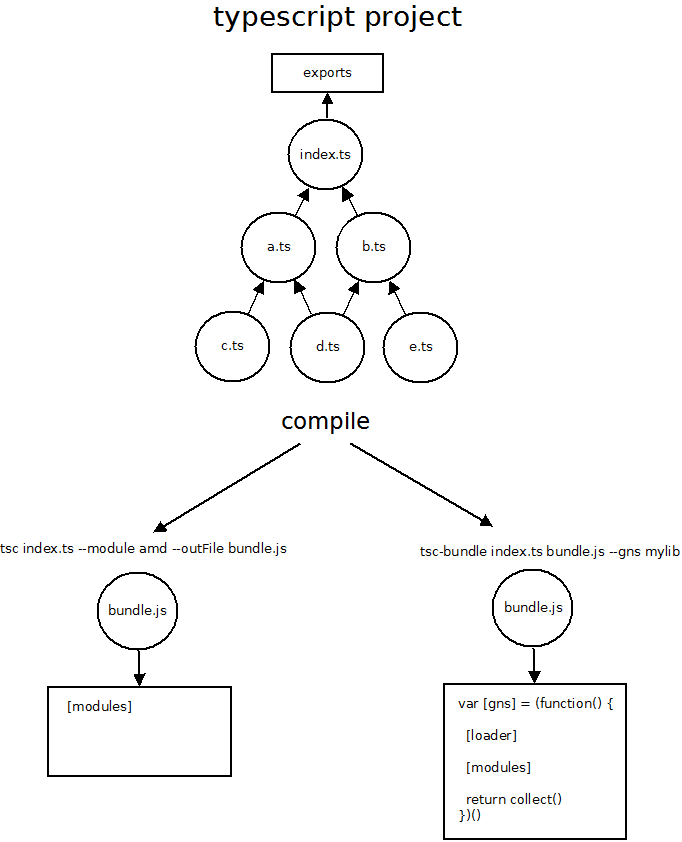

# typescript-bundle
### bundle modular typescript projects for the browser
## install
```
npm install typescript -g
npm install typescript-bundle -g 
```
## usage
code
```typescript
// myapp.ts
export function helloworld() { ... }
```
compile
```
tsc-bundle myapp.ts myapp.js --globalNamespace myapp
```
run
```html
<script src="./myapp.js">
   myapp.helloworld()
</script>
```

## overview

typescript-bundle is a small command line utility for compiling modular typescript projects into a single output script that is directly consumable inside a web page with a ```<script>``` tag. 

## command line options

typescript-bundle's cli is similar to the tsc cli except that it expects exactly one input typescript file and emits one output javascript file. 

> typescript-bundle expects the ```input.ts``` typescript file to ```import``` other files to be included in the compilation, and ```export``` the members that are to be visable to the page.


The command line interface is as follows...
```
tsc-bundle [input] [output] [--globalNamespace] [...standard tsc compiler options]
```
An example of which might look something like...
```
tsc-bundle input.ts output.js --globalNamespace myapp --target es2015 --noImplicitAny --watch
```
> typescript-bundle supports most of the tsc compiler switches except for ```--module``` and ```--outFile``` which are internally set to ```AMD``` and the given output filename respectively.

> the ```--globalNamespace``` option will expose the given name ```myapp``` to the page when referenced. If omitted, typecript-bundle will simply wrap all compiled modules within a function closure inaccessible to the page.

By default, typescript-bundle will inherit the configurations within a ```tsconfig.json``` if found within the current working directory, otherwise a configuration can be specified with the following.
```
tsc-bundle input.ts bundle.js -p ./settings/tsconfig.json
```

## how does this project work

typescript-bundle internally calls the typescript compiler with the options ```--module amd``` and
```--outFile```. This causes the typescript compiler to emit a single AMD bundle containing all modules
it locates by traversing imports throughout the project. From here, typescript-bundle rewrites the 
compilers output with a mini AMD module loader which is used to wrap the compilers output.

A high level view of the bundles output is as follows.

```javascript
var [global namespace] = (function() {

  [typescript-bundle module loader]

  [typescript amd outfile bundle]

  return collect()
})()
```
To further illustrate, consider the following which outlines the default ```AMD outfile``` output
produced by the typescript compiler, and how that rewritten by typescript-bundle.



## notes

- typescript-bundle can only accept a single input.ts file to compile. This file is considered a top most module, 
and should import the other modules you want to include in the compilation.
- the index.ts is responsible for exporting objects to the page. Only exports on this module are publically accessible, 
all exported variables in other modules are private. 
- The exports on index.ts are written to the ```--globalNamespace``` variable name given at the command line. If no global 
namespace is given, the modules are wrapped within a closure and inaccessble to the page.
- typescript-bundle ignores ```--outFile, --outDir and ---module``` compiler options.  Internally, these options are set
to ```--module amd``` and ```--outFile [bundle.js]``` where bundle.js is provided as the second argument at the command line.
- source maps are not available. 

## building the project
The project can be built by running the following command from the project root.
```
node tasks build
```